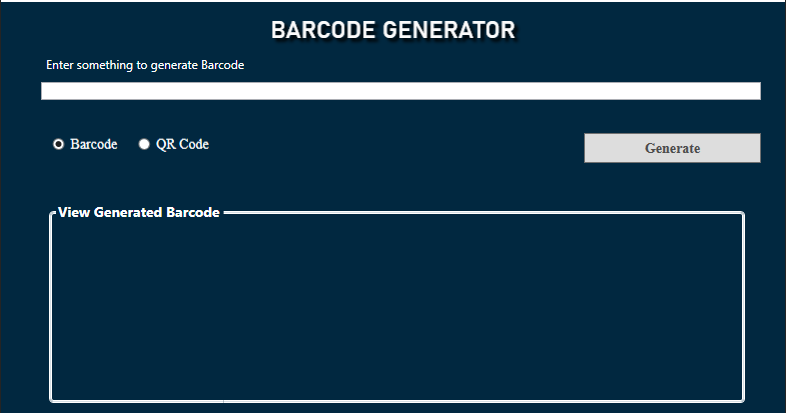

# Barcode and QR Code Generator

This is a desktop application built with WPF (.NET) that generates barcodes and QR codes using the Spire.Barcode NuGet package. The application provides a simple user interface for generating and previewing barcode or QR code images based on user input.

---

## Features

- **Barcode Generation:** Generate barcodes using Code39 format.
- **QR Code Generation:** Generate QR codes for any text input.
- **Preview Images:** Display the generated barcode/QR code in the application.
- **Save to File:** Automatically save the generated images to an output folder.
- **Error Handling:** Prevents overwriting files with duplicate names.

---

## Prerequisites

1. **Windows Operating System** (for WPF applications).
2. **.NET Framework 4.7.2** or higher / **.NET Core 3.1** or higher.
3. **Spire.Barcode NuGet Package**:
   - Install via NuGet Package Manager:
     ```bash
     Install-Package Spire.Barcode
     ```

---

## How to Use

### 1. Clone the Repository
```bash
git clone https://github.com/biswajitpanday/BarcodeGenerator.git
cd BarcodeGenerator
```

### 2. Open the Solution
- Open the `.sln` file in Visual Studio.

### 3. Run the Application
- Press `F5` to build and run the application.

### 4. Generate Barcode/QR Code
- Enter text in the input field.
- Select either "Barcode" or "QR Code" using the radio buttons.
- Click the "Generate" button.
- The generated image will be previewed in the application.
- The file is saved in the `outputs` folder within the application directory.

---

## File Structure

```plaintext
|-- BarcodeGenerator
|   |-- MainWindow.xaml       # UI layout
|   |-- MainWindow.xaml.cs    # Code-behind logic
|   |-- App.xaml              # Application startup configuration
|   |-- outputs/              # Folder to store generated images
|-- BarcodeGenerator.sln      # Solution file
|-- README.md                 # Project documentation
```


## Screenshot

Below is a preview of the application displaying a generated barcode:




---

## Error Handling

- If the application encounters an existing file with the same name, it will prompt the user with an error message.
- Ensure the input field is not empty before clicking "Generate." Blank input will result in an error.

---

## Dependencies

- **Spire.Barcode**: A comprehensive library for generating barcodes and QR codes.

---

## Future Enhancements

- Allow users to customize the appearance of barcodes and QR codes (e.g., size, colors).
- Add support for additional barcode formats.
- Provide an option to select output folder.
- Implement drag-and-drop functionality for input.

---

## License

This project is open-source and available under the [MIT License](LICENSE).

---

## Contributing

Contributions are welcome! Please submit a pull request or create an issue for any suggestions or bugs.

---

## Contact

For any queries, please contact [biswajitmailid@gmail.com].
